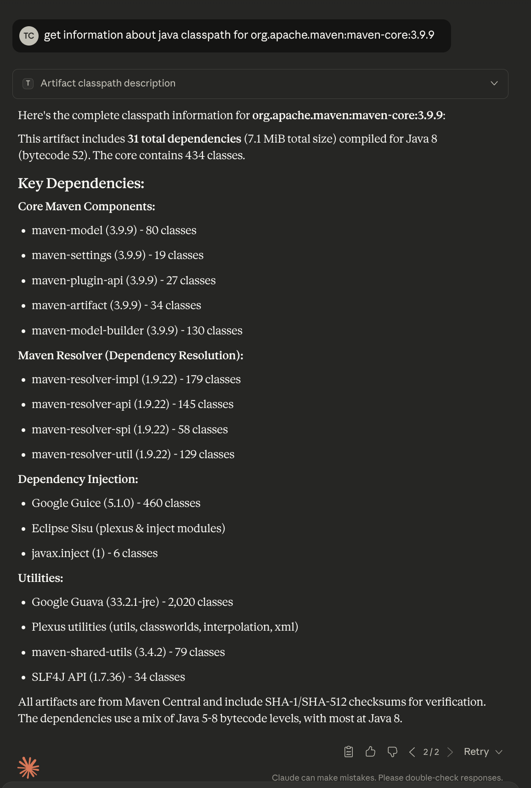

# Toolbox MCP (powered with Quarkus)

A Model Context Protocol (MCP) server that exposes Maven Toolbox capabilities to AI assistants like Claude.

## Installation

To use it:
* build it and make it resolvable (meaning `mvn install`)
* add following snippet to MCP client (ie Claude Desktop uses `$HOME/.config/Claude/claude_desktop_config.json`):
```json
    "mcpServers": {
        "toolbox": {
            "command": "jbang",
            "args": ["--quiet",
                    "eu.maveniverse.maven.toolbox:mcp:0.14.6-SNAPSHOT:runner"]
        }
    }
```

## Available Tools

The MCP server provides 15 tools for Maven artifact analysis:

### Basic Artifact Information
- **artifactExists** - Check if a Maven artifact exists
- **artifactBasicProperties** - Get artifact basic properties
- **artifactNewerVersions** - Get newer versions of an artifact

### Dependency Analysis
- **artifactDependencyTree** - Get dependency tree for an artifact
- **artifactClasspath** - Get classpath (list of all transitive dependencies)
- **artifactClasspathDescription** - Get classpath constituents and their descriptions
- **artifactClasspathDiff** - Compare classpaths of two artifacts
- **artifactClasspathConflict** - Detect classpath conflicts between two artifacts
- **artifactTreeDiff** - Compare dependency trees of two artifacts

### Search & Discovery
- **artifactSearch** - Search for Maven artifacts by expression (supports query syntax)
- **artifactIdentify** - Identify Maven artifact by file SHA-1 hash
- **artifactList** - List available versions or artifacts for a given groupId or groupId:artifactId
- **artifactVerify** - Verify Maven artifact SHA-1 checksum

### Version Analysis
- **artifactLibYear** - Calculate libyear metric to measure dependency freshness

### Repository Information
- **artifactRepositories** - List repositories that would be used to resolve an artifact

All tools accept artifacts in `groupId:artifactId:version` (GAV) format and return markdown-formatted output.

## Example

Example session with Claude Desktop: 
